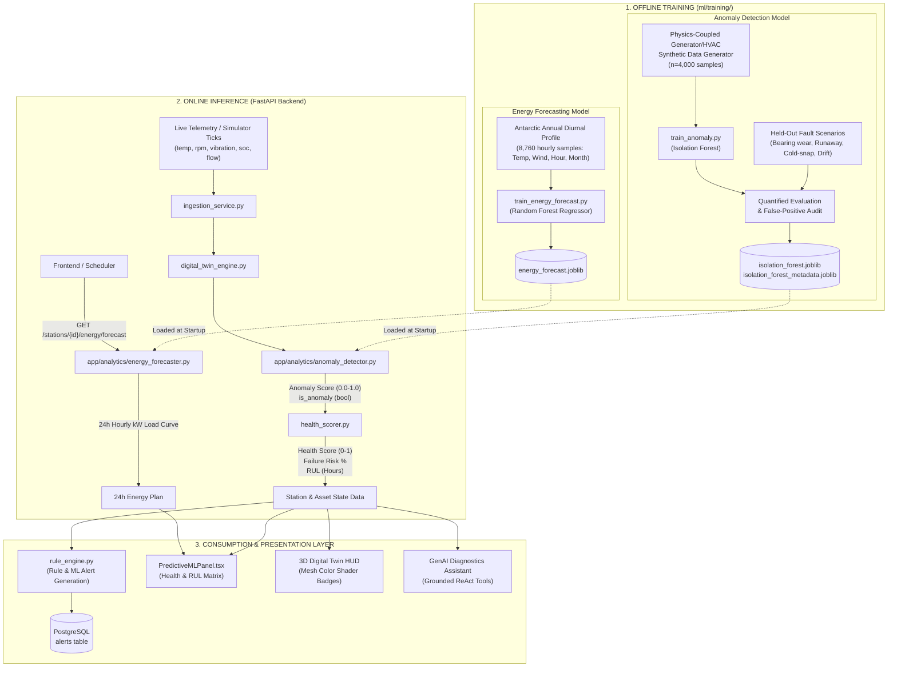

# PolarTwin Machine Learning & Predictive Analytics Pipeline

## 1. Overview & System Architecture

PolarTwin incorporates a dual-phase Machine Learning architecture designed to ensure extreme reliability, predictive health prognostics, and energy optimization across India's Antarctic research stations (**Maitri** and **Bharati**).

The ML system consists of two primary operational stages:
1. **Offline Training Phase**: Physics-informed data synthesis, model fitting, validation against real-world polar fault scenarios, and artifact serialization.
2. **Online Real-Time Inference Phase**: Dynamic model loading in the FastAPI backend, per-tick anomaly scoring, multi-variable health and Remaining Useful Life (RUL) prognostics, 24-hour energy forecasting, alert dispatch, and 3D digital twin HUD visualization.



---

## 2. Model Training Details (Offline Phase)

Both models are trained offline using scripts located in `polar-twin-backend/ml/training/`. The generated binaries are saved to `polar-twin-backend/ml/models/`.

### 2.1 Anomaly Detection Model: Isolation Forest
* **Script**: `polar-twin-backend/ml/training/train_anomaly.py`
* **Artifact Location**: `polar-twin-backend/ml/models/anomaly/isolation_forest.joblib`
* **Metadata Location**: `polar-twin-backend/ml/models/anomaly/isolation_forest_metadata.joblib`
* **Model Class**: `sklearn.ensemble.IsolationForest`

#### Hyperparameters
| Parameter | Value | Rationale |
|---|---|---|
| `n_estimators` | `200` | High tree count provides smooth decision boundaries in 6D feature space |
| `contamination` | `0.03` | Assumes 3% outlier boundary in raw telemetry distributions |
| `bootstrap` | `True` | Enhances generalization across unpredictable polar weather extremes |
| `random_state` | `42` | Guarantees deterministic reproducibility |

#### Features & Physics Coupling
Rather than sampling random values independently, the training pipeline couples features thermodynamically and mechanically:
1. `generator_temp` (°C): Driven by load fraction ($0.4 - 1.0$), setpoint centered at 78°C.
2. `generator_rpm` (RPM): Features natural governor droop as engine temperature exceeds setpoint ($\Delta T \times 1.8\text{ RPM}$).
3. `generator_vibration` (mm/s): Exponential mechanical stress response proportional to $|\text{RPM} - \text{setpoint}|$.
4. `battery_soc` (%): Operational battery state-of-charge band ($55\% - 95\%$).
5. `battery_temp` (°C): Coupled to ambient outdoor Antarctic temperatures and $I^2R$ self-heating under discharge.
6. `hvac_flow` (%): Dynamic feedback regulation compensating for extreme ambient cold and battery cooling.

#### Fault Scenarios Evaluated
The model is validated against four held-out failure modes to guarantee low false-positive rates on nominal telemetry while achieving high recall on genuine faults:
* **Bearing Wear**: Severe vibration ($>7\text{ mm/s}$) with normal RPM and normal temperature.
* **Radiator Clogging / Thermal Runaway**: Temperature rises above $98^\circ\text{C}$ causing governor droop below $1450\text{ RPM}$.
* **HVAC Failure During Cold Snap**: HVAC flow drops to $5-25\%$, causing battery temperature to cold-soak below $0^\circ\text{C}$.
* **Sensor Drift**: Vibration sensor reads flat/dead ($0.05-0.2\text{ mm/s}$) decoupled from load.

---

### 2.2 Energy Load Forecasting Model: Random Forest Regressor
* **Script**: `polar-twin-backend/ml/training/train_energy_forecast.py`
* **Artifact Location**: `polar-twin-backend/ml/models/forecasting/energy_forecast.joblib`
* **Model Class**: `sklearn.ensemble.RandomForestRegressor`

#### Hyperparameters
| Parameter | Value | Rationale |
|---|---|---|
| `n_estimators` | `100` | Sufficient ensemble capacity for non-linear load modeling |
| `max_depth` | `12` | Prevents overfitting to synthetic noise while capturing diurnal trends |
| `n_jobs` | `-1` | Parallelized multi-core training |
| `random_state` | `42` | Reproducible regression splits |

#### Input Features & Output Target
* **Input Features ($X$)**:
  1. `hour_of_day` ($0 - 23$)
  2. `month_of_year` ($1 - 12$)
  3. `ambient_temp` (Antarctic profile: $-40^\circ\text{C}$ in winter to $-15^\circ\text{C}$ in summer)
  4. `wind_speed` (Weibull-distributed polar wind, $0 - 60\text{ knots}$)
* **Target ($y$)**: Total station electrical and thermal base load ($\text{kW}$), accounting for heating penalties during severe cold and diurnal human activity peaks.

---

## 3. Real-Time Model Inference & Data Usage (Online Phase)

During application runtime, models are loaded into memory and applied to incoming sensor feeds.

### 3.1 Anomaly Scoring (`app/analytics/anomaly_detector.py`)
1. On each tick or asset state update, `anomaly_detector.predict_anomaly(features)` receives live sensor values:
   ```python
   vector = np.array([[temp, rpm, vibration, soc, bat_temp, flow]])
   ```
2. The Isolation Forest computes the raw isolation score:
   ```python
   raw_score = self.model.decision_function(vector)[0]
   # Normalized to [0.0, 1.0] anomaly severity
   anomaly_score = float(np.clip(1.0 - (raw_score + 0.5), 0.0, 1.0))
   is_anomaly = bool(anomaly_score > 0.65)
   ```
3. If the model artifact is unavailable, an active heuristic fallback computes threshold deltas automatically.

### 3.2 Subsystem Health & RUL Prognostics (`app/analytics/health_scorer.py`)
The raw ML anomaly score feeds into the multi-variable health engine:
```python
total_penalty = (anomaly_score * 0.35) + temp_penalty + vib_penalty + soc_penalty
health_score = round(max(0.10, min(1.0, base_health - total_penalty)), 3)
```

From this health score, two key prognostic metrics are calculated:
* **Failure Probability ($P_f$)**:
  $$P_f = \text{clamp}\big((1.0 - \text{health\_score}) \times 1.2,\; 0.01,\; 0.99\big)$$
* **Remaining Useful Life (RUL)** in hours:
  * $\text{health} \ge 0.90 \implies \text{RUL} = 8,500\text{ hrs} \times (\text{health} / 0.95)$
  * $0.75 \le \text{health} < 0.90 \implies \text{RUL} = 2,400\text{ hrs} \times (\text{health} / 0.85)$
  * $\text{health} < 0.75 \implies \text{RUL} = 320\text{ hrs} \times (\text{health} / 0.50)$

### 3.3 24-Hour Predictive Energy Scheduling (`app/analytics/energy_forecaster.py`)
Served via API endpoint `GET /api/v1/stations/{station_id}/energy/forecast`:
* Simulates the diurnal temperature cycle and wind profile for the upcoming 24 hours.
* Calls `model.predict([[hour, month, temp, wind]])`.
* Applies station scaling (e.g. **Bharati** receives a $1.22\times$ factor due to its larger aerodynamic building footprint and satellite ground station load).
* Outputs:
  * `predicted_load_kw`: Base expected demand.
  * `generation_target_kw`: Recommended dispatch schedule including a $20\text{ kW}$ safety reserve margin for battery energy storage.
  * `solar_contribution_kw`: Solar irradiance offset calculated during polar summer daylight hours.

---

## 4. Integration with Alerts, Database & Frontend

### 4.1 Alert Engine (`app/alerts/rule_engine.py` & `alert_service.py`)
* Evaluates station state after health scoring.
* Generates structured alerts (`CRITICAL`, `WARNING`, `INFO`) when temperatures exceed critical thresholds, batteries drop below $10\%$, or compound risks occur (e.g. Generator Outage + Battery Depleted = Station Blackout Risk).
* Stores records in PostgreSQL `alerts` table and notifies connected operators via WebSocket.

### 4.2 Frontend Presentation
* **Predictive ML Panel (`PredictiveMLPanel.tsx`)**:
  Renders the 24-hour forecasted demand vs. generation curve and provides an interactive matrix showing each subsystem's anomaly score, failure risk %, and RUL countdown.
* **3D Digital Twin HUD (`DigitalTwinHUD.tsx` & Station Canvas)**:
  Applies real-time color shaders to 3D station meshes (Nominal Green, Warning Amber, Flashing Red) reflecting asset health scores.
* **AI Diagnostics Assistant (`app/ai/assistant.py`)**:
  The LLM ReAct agent queries asset health and anomaly scores directly through backend tools to provide context-aware diagnostic reports and preventive maintenance schedules to base commanders.

---

## 5. Execution & Retraining Guide

### Train Anomaly Detection Model
```powershell
cd polar-twin/polar-twin-backend
python ml/training/train_anomaly.py
```
*Output*:
```
=== Evaluation ===
[Held-out nominal] n=500  flagged_anomaly_rate=2.8%  mean_score=0.142  (expected low)
[bearing_wear] n=150  flagged_anomaly_rate=98.7%  mean_score=-0.185  (expected high)
[radiator_clogging_thermal_runaway] n=150  flagged_anomaly_rate=100.0%  (expected high)
[SUCCESS] Anomaly Detection Isolation Forest model saved to: ml/models/anomaly/isolation_forest.joblib
```

### Train Energy Forecasting Model
```powershell
cd polar-twin/polar-twin-backend
python ml/training/train_energy_forecast.py
```
*Output*:
```
[SUCCESS] Energy Forecasting Random Forest model saved to: ml/models/forecasting/energy_forecast.joblib
```
